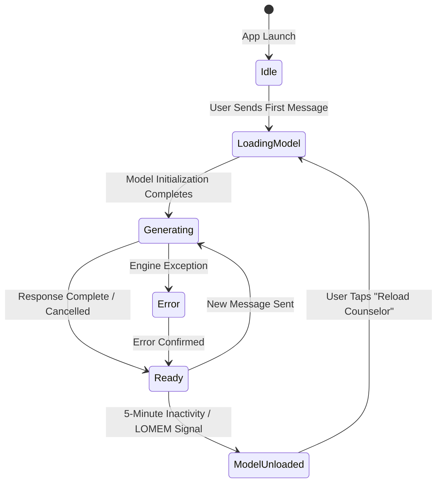

# App User Interface and ViewModel Design - Admission Counselor AI

This document specifies the Jetpack Compose Composable hierarchies, the ViewModel state-machine, token streaming mechanics, and the integration of the REVA University brand guidelines.

---

## 1. ViewModel UI State-Machine

The application uses an unidirectional data flow pattern. The UI state is modeled as a Kotlin sealed interface.



### 1.1 UI States Definition

| State Name | State Properties | Trigger Event | UI Representation |
| :--- | :--- | :--- | :--- |
| `Idle` | None | Initial app launch. | Empty conversation screen with a welcoming header and suggested prompts. |
| `LoadingModel` | `val progress: Float` | User query submitted while engine is unloaded. | Renders a custom orange progress indicator showing model loading status. |
| `Ready` | None | Loading finishes or generation completes. | Active chat history displayed, text input box is enabled. |
| `Generating` | `val partialText: String` | Inactive Mutex acquired and token stream begins. | Renders counselor answer bubble with live-updating streaming text. |
| `ModelUnloaded` | `val reason: String` | Idle timeout met or Android LOMEM broadcast received. | Displays a status banner: "Counselor memory released." Shows a prominent reload button. |
| `Error` | `val message: String` | Engine lock contention, database failure, or runtime crash. | Renders an alert dialog detailing the error with a confirmation close button. |

---

## 2. REVA University Brand Integration

Every visual interface element must adhere to the official REVA University brand standards.

### 2.1 Color Scheme Map

| Brand Color | Hex Code | Android Color Reference | UI Element Target |
| :--- | :--- | :--- | :--- |
| **REVA Orange** | `#f7a35b` | `Color(0xFFF7A35B)` | Primary accent, Send button background, progress bar, reload buttons. |
| **REVA Grey** | `#4a4c55` | `Color(0xFF4A4C55)` | Primary header background, primary text, user message bubbles. |
| **White** | `#ffffff` | `Color(0xFFFFFFFF)` | Chat screen background, reversed text elements, counselor bubble background. |

### 2.2 Typography Map

| Font Family | Style / Weight | Compose Code Reference | Use Case Target |
| :--- | :--- | :--- | :--- |
| **Plus Jakarta Sans** | Bold, 18sp | `FontFamily(Font(R.font.plus_jakarta_sans_bold))` | Header titles, section dividers, dialog headings. |
| **Plus Jakarta Sans** | Medium, 14sp | `FontFamily(Font(R.font.plus_jakarta_sans_medium))` | Send button label, toast messages, status banners. |
| **Glacial Indifference** | Regular, 16sp | `FontFamily(Font(R.font.glacial_indifference_regular))` | Chat bubble message content, query input text. |

---

## 3. Jetpack Compose UI Hierarchy

The user interface consists of nested Composable layouts.

```
+---------------------------------------------------------+
| [NAAC A+] (Top-Left)           REVA University (Top-Right) |
| [Header Title: REVA Admission Counselor]                |
+---------------------------------------------------------+
|                                                         |
|  [Student Chat Bubble] (REVA Grey background, white text)|
|                                                         |
|  [Counselor Bubble] (White background, grey text,       |
|                      Orange left-accent border)         |
|                                                         |
|  [Status Banner: Counselor memory released.  (Reload)]  |
|                                                         |
+---------------------------------------------------------+
| [Enter message here...                     ] [Send (Or)] |
+---------------------------------------------------------+
```

### 3.1 Core Composable Layout Elements

#### `ChatScreen`
The main outer viewport layout.
- **Background**: White (`#ffffff`).
- **Layout**: Scaffold with a top bar, a scrollable column list for chat history, and a bottom input bar.

#### `HeaderBar`
Adheres strictly to logo placement and clear space criteria.
- **Background**: REVA Grey (`#4a4c55`).
- **Logo Placement**: 
  - NAAC A+ logo unit placed in the top-left corner.
  - Primary REVA logo wordmark + Srivatsa symbol unit placed in the top-right corner.
  - Spacing: Clear space around logo units set to a minimum of 16dp (equivalent to 2x height scaling for clear space boundaries).

#### `ChatBubble`
Represents individual conversational entries.
- **Student Bubble**:
  - Background: REVA Grey (`#4a4c55`).
  - Text: White (`#ffffff`), Glacial Indifference font.
  - Alignment: Right-aligned.
- **Counselor Bubble**:
  - Background: White (`#ffffff`).
  - Border: 1dp solid lines in REVA Orange (`#f7a35b`) on the left edge.
  - Text: REVA Grey (`#4a4c55`), Glacial Indifference font.
  - Alignment: Left-aligned.

#### `InputBar`
Accepts text entries.
- **Background**: Light grey container.
- **Action Button**: Circular Send icon. Background color is REVA Orange (`#f7a35b`), icon color is White (`#ffffff`).

---

## 4. Streaming Token Flow Collection

To provide responsive UI feedback, the ViewModel collects response flows from the inference thread and maps them to the Compose state.

```kotlin
// Uses Hilt constructor injection (MED-06 fix)
@HiltViewModel
class CounselorViewModel @Inject constructor(
    private val engine: LocalLlmEngine
) : ViewModel() {

    private val _uiState = MutableStateFlow<CounselorUiState>(CounselorUiState.Idle)
    val uiState: StateFlow<CounselorUiState> = _uiState.asStateFlow()

    private val _messages = MutableStateFlow<List<ChatMessage>>(emptyList())
    val messages: StateFlow<List<ChatMessage>> = _messages.asStateFlow()

    // Mutable accumulator for the actively generating message.
    // Tokens are appended here instead of copying the entire list per token.
    private val _streamingText = MutableStateFlow("")
    val streamingText: StateFlow<String> = _streamingText.asStateFlow()

    private var activeJob: Job? = null

    fun sendMessage(text: String) {
        val userMessage = ChatMessage(text, isUser = true)
        _messages.update { it + userMessage }

        // Cancel any active generation before starting a new one.
        // This calls engine.cancelGeneration() which closes the native
        // LiteRT-LM session and reinitializes (since LiteRT-LM lacks a
        // native cancel API).
        activeJob?.cancel()
        viewModelScope.launch { engine.cancelGeneration() }

        activeJob = viewModelScope.launch(Dispatchers.Main) {
            _uiState.value = CounselorUiState.LoadingModel(0.0f)
            _streamingText.value = ""

            try {
                engine.generateResponse(text).collect { token ->
                    _uiState.value = CounselorUiState.Generating(token)
                    // Append to the mutable accumulator (O(1) per token).
                    // The Compose UI observes streamingText directly for
                    // the active bubble, avoiding full list recomposition.
                    _streamingText.update { it + token }
                }
                // Generation complete: commit the final text to the message list.
                val finalText = _streamingText.value
                _messages.update { it + ChatMessage(finalText, isUser = false) }
                _streamingText.value = ""
                _uiState.value = CounselorUiState.Ready
            } catch (e: EngineBusyException) {
                _uiState.value = CounselorUiState.Error(e.message ?: "Engine busy")
            } catch (e: CancellationException) {
                // Normal cancellation, do not treat as error
                throw e
            } catch (e: Exception) {
                _uiState.value = CounselorUiState.Error(e.message ?: "Unknown Error")
            }
        }
    }

    fun stopGeneration() {
        activeJob?.cancel()
        viewModelScope.launch { engine.cancelGeneration() }
        // Commit any partial text that was generated before cancellation.
        val partialText = _streamingText.value
        if (partialText.isNotEmpty()) {
            _messages.update { it + ChatMessage(partialText + " [cancelled]", isUser = false) }
            _streamingText.value = ""
        }
        _uiState.value = CounselorUiState.Ready
    }

    override fun onCleared() {
        super.onCleared()
        // Shut down the dedicated executor thread to prevent leaks (HIGH-03 fix).
        engine.destroy()
    }
}
```
