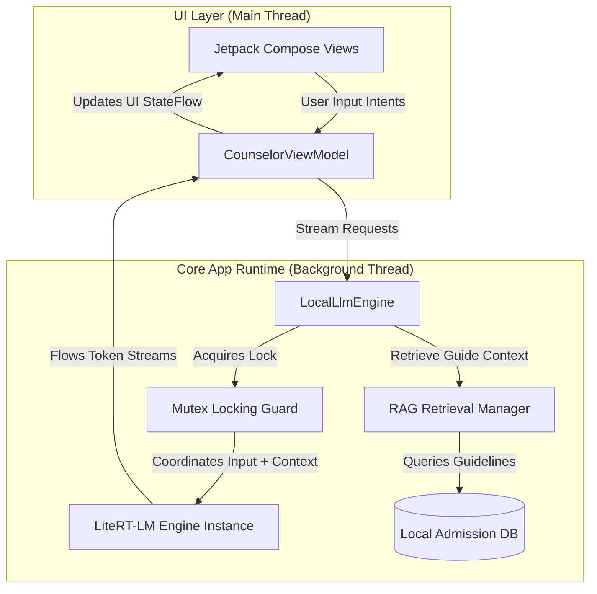
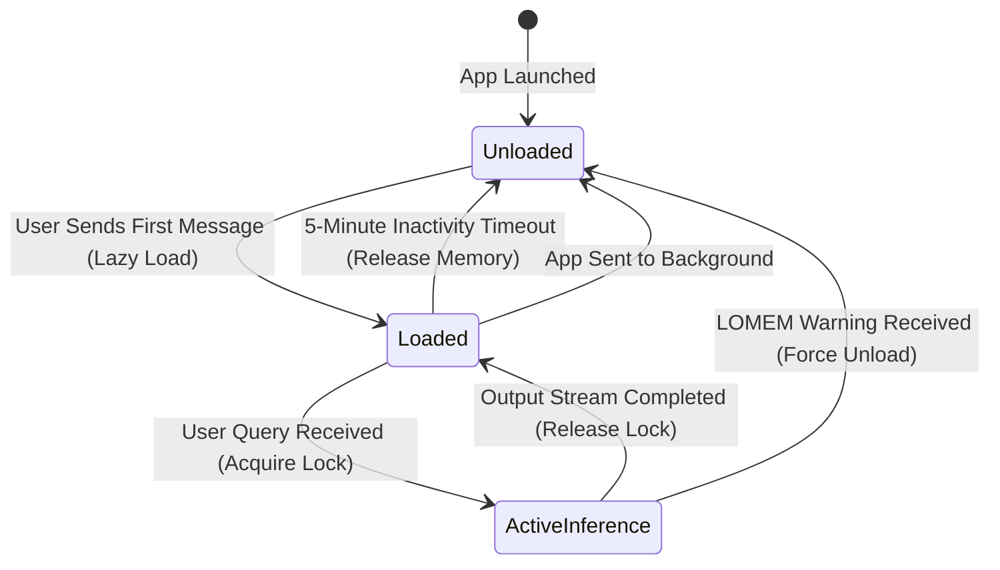

# Architecture Specification - Admission Counselor AI

This document defines the standalone application architecture, the Kotlin Coroutines background threading containment model, and the mutual exclusion locking patterns for the LiteRT-LM inference engine.

---

## 1. Application System Topology

The Admission Counselor AI platform runs entirely within a single standalone Android application boundary. The application does not require any cross-app Inter-Process Communication (IPC) or Android Interface Definition Language (AIDL) bindings.



---

## 2. Background Threading and Concurrency Model

### 2.1 Thread Containment
To keep the Main UI thread free of performance bottlenecks, all model lifecycle commands (loading, token generation, and unloading) must execute on a dedicated background thread. 

We use Kotlin Coroutines for lightweight thread containment.

### 2.2 Execution Dispatchers

| Dispatcher Target | Thread Binding | Core Usage |
| :--- | :--- | :--- |
| `Dispatchers.Main` | Main UI Thread | UI rendering, Compose layout updates, ViewModel state observation. |
| `LlmDispatcher` | `Executors.newSingleThreadExecutor().asCoroutineDispatcher()` | Sequential execution of all model load, stream, and unload commands. Must be explicitly closed via `executor.shutdown()` during engine teardown. |
| `Dispatchers.IO` | Thread Pool (IO) | Local database queries, file system access, and RAG indexing operations. |

---

## 3. Mutual Exclusion & Concurrency Control

The LiteRT-LM `LlmInference` runtime engine is not thread-safe. Overlapping calls to model generation or context resets will crash the process or cause severe Out-of-Memory spikes on-device.

### 3.1 Mutex Locking Implementation
We enforce a strict single active session constraint using a Kotlin Coroutines `Mutex` with `tryLock()` for immediate busy rejection. The Mutex is never held for the full duration of generation; it guards only initialization and state transitions.

```kotlin
class LocalLlmEngine(
    private val context: Context,
    private val modelPath: String, // Resolved dynamically from AssetDeliveryManager
    private val llmDispatcher: CoroutineDispatcher
) {
    private val sessionMutex = Mutex()
    private var inferenceEngine: LlmInference? = null
    private var activeChannel: Channel<String>? = null

    // Throws EngineBusyException immediately if engine is already generating.
    // Does NOT queue or suspend waiting callers.
    suspend fun generateResponse(prompt: String): Flow<String> = flow {
        if (!sessionMutex.tryLock()) {
            throw EngineBusyException("Counselor is busy formulating a response")
        }
        try {
            val engine = getOrInitializeEngine()
            val channel = Channel<String>(Channel.UNLIMITED)
            activeChannel = channel

            engine.generateAsync(prompt) { token, done, error ->
                when {
                    error != null -> channel.close(error)
                    done -> channel.close()          // Terminal signal: generation complete
                    token != null -> channel.trySend(token)
                }
            }

            for (token in channel) {
                emit(token)
            }
            // Re-throw if the channel was closed with an exception
            channel.closeCause?.let { throw it }
        } finally {
            activeChannel = null
            sessionMutex.unlock()
        }
    }.flowOn(llmDispatcher)

    // Cancels active generation by closing the token channel and
    // reinitializing the engine (LiteRT-LM lacks a native cancel API).
    suspend fun cancelGeneration() = withContext(llmDispatcher) {
        activeChannel?.close(CancellationException("User cancelled generation"))
        activeChannel = null
        inferenceEngine?.close()
        inferenceEngine = null
        // Mutex is released by the finally block in generateResponse
    }

    suspend fun unloadModel() = withContext(llmDispatcher) {
        activeChannel?.close(CancellationException("Model unloading"))
        activeChannel = null
        inferenceEngine?.close()
        inferenceEngine = null
        // Note: No System.gc() call. ART's concurrent GC reclaims
        // JVM heap automatically. Native memory from LlmInference.close()
        // is freed immediately by the native destructor.
    }

    fun destroy() {
        // Called during Application.onTerminate or ViewModel.onCleared
        (llmDispatcher as? ExecutorCoroutineDispatcher)?.close()
    }

    private suspend fun getOrInitializeEngine(): LlmInference = withContext(llmDispatcher) {
        if (inferenceEngine == null) {
            val options = LlmInference.LlmInferenceOptions.builder()
                .setModelPath(modelPath)
                .setTemperature(0.2f)
                .setTopK(40)
                .setMaxTokens(2048)
                .build()
            inferenceEngine = LlmInference.createFromOptions(context, options)
        }
        inferenceEngine!!
    }
}
```

---

## 4. Single active session enforcement policy

When a user initiates an inference request while the engine is already generating a response, the system enforces a non-queuing busy policy.

| Concurrent Request State | System Action | UI Presentation |
| :--- | :--- | :--- |
| **Engine Idle** | Acquire lock and begin generating tokens. | Render text tokens incrementally in chat bubbles. |
| **Engine Busy (Active Generating)** | Reject new request immediately without queueing. | Display a "Counselor is busy formulating a response" warning toast or banner. |

---

## 5. Lifecycle and Memory Management

Running a 2.58 GB model on mid-range Android devices requires aggressive memory management.



### 5.1 Idle Timeout Unloading
To prevent the application from keeping 2.58 GB of RAM locked up indefinitely:
1. The engine tracks the timestamp of the last generated response.
2. An inactivity job polls every 60 seconds.
3. If 5 minutes pass without active user interaction, the engine calls `unloadModel()` which closes the `LlmInference` instance and sets the pointer to `null`.
4. No explicit `System.gc()` call is made. ART's concurrent garbage collector reclaims JVM heap memory automatically, and the native memory from `LlmInference.close()` is freed immediately by the native destructor.

### 5.2 Background Lifecycle Events
- **App Backgrounding (ProcessLifecycleOwner `ON_STOP`)**: When the entire application process moves to the background (detected via `ProcessLifecycleOwner`, not individual Activity lifecycle), the idle timeout countdown begins. The model is NOT immediately unloaded, because brief interruptions (notification pulldown, screen rotation) would cause unnecessary 2-5 second reload delays.
- **Sustained Background (30+ seconds)**: If the app remains in `STOPPED` state for 30 seconds or more, the engine triggers an immediate `unloadModel()` to free the 2.58 GB allocation.
- **OnDestroy**: If the app process is terminated, the engine releases the model in its `onCleared()` ViewModel lifecycle callback and calls `engine.destroy()` to shut down the dedicated executor thread.
- **Low Memory (LOMEM)**: When `onTrimMemory(TRIM_MEMORY_RUNNING_CRITICAL)` is invoked by the Android OS, the engine forces an immediate `cancelGeneration()` followed by `unloadModel()`, terminating any active generation streams.
