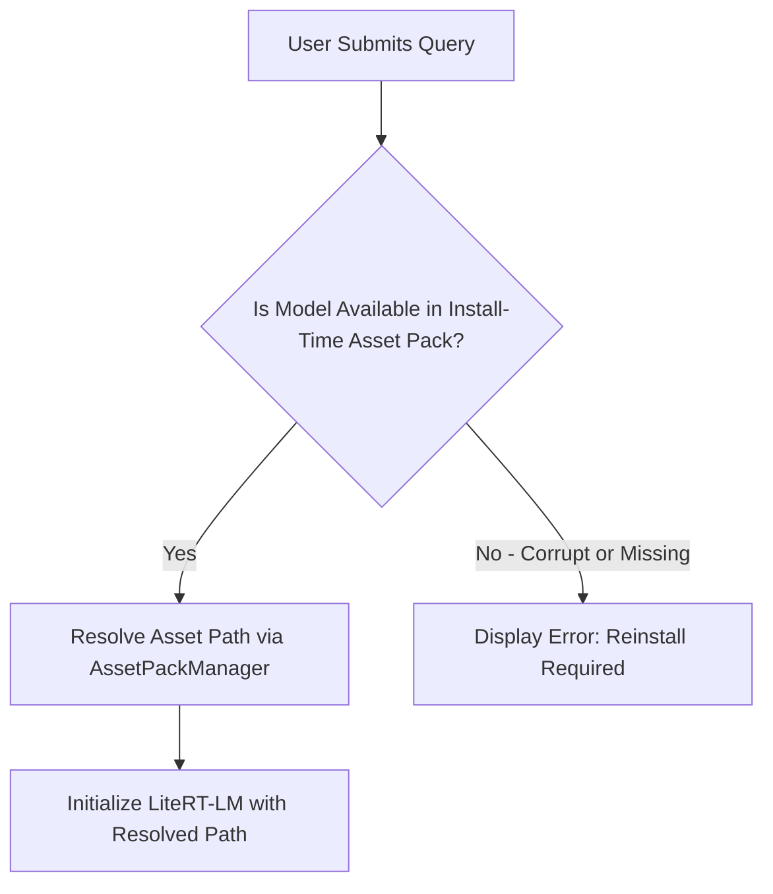

# Build and Asset Packaging Guide - Admission Counselor AI

This document details the Gradle multi-module layout, Google Play Asset Delivery (PAD) configurations, model asset downloading pipelines, and offline database provisioning logic.

---

## 1. Project Module Structure

The Android project is structured as a multi-module Gradle project to separate the primary application runtime from the heavy model asset package.

```
project-root/
│
├── build.gradle (Project level)
├── settings.gradle
│
├── app/ (Main application module)
│   ├── build.gradle
│   └── src/main/
│       ├── assets/
│       │   └── databases/
│       │       └── admission.db (Offline database template)
│       └── java/com/admission/counselor/ (Java/Kotlin Source)
│
└── model_asset/ (Play Asset Delivery module)
    ├── build.gradle
    └── src/main/assets/
        └── gemma-4-E2B-it.litertlm (2.58 GB Model File)
```

---

## 2. Play Asset Delivery (PAD) Configuration

Google Play Store restricts base APK package sizes to **150 MB**. The `gemma-4-E2B-it` model file is **2.58 GB** on-disk. To deliver this asset, the project uses **install-time** Play Asset Delivery.

Install-time delivery bundles the model asset with the AAB (Android App Bundle) and is downloaded automatically during app installation via Google Play. This eliminates the need for any post-install network access, preserving the app's zero-network-permission security model.

### 2.1 settings.gradle Configuration
Declare the application and asset pack modules in the project settings file:

```groovy
// settings.gradle
pluginManagement {
    repositories {
        google()
        mavenCentral()
        gradlePluginPortal()
    }
}
dependencyResolutionManagement {
    repositoriesMode.set(RepositoriesMode.FAIL_ON_PROJECT_REPOS)
    repositories {
        google()
        mavenCentral()
    }
}
rootProject.name = "AdmissionCounselorAI"
include ':app'
include ':model_asset'
project(':model_asset').projectDir = new File(rootDir, 'model_asset')
```

### 2.2 model_asset/build.gradle Configuration
Apply the asset-pack plugin and set the delivery mode to `install-time`:

```groovy
// model_asset/build.gradle
plugins {
    id 'com.android.asset-pack'
}

assetPack {
    packName = "model_asset"
    dynamicDelivery {
        deliveryMode = "install-time"
    }
}
```

### 2.3 app/build.gradle Configuration
Link the main application module with the asset pack and declare Play Core dependencies:

```groovy
// app/build.gradle
plugins {
    id 'com.android.application'
    id 'kotlin-android'
}

android {
    namespace 'com.admission.counselor'
    compileSdk 34

    defaultConfig {
        applicationId "com.admission.counselor"
        minSdk 29
        targetSdk 34
        versionCode 1
        versionName "1.0.0"
    }

    buildTypes {
        release {
            minifyEnabled true
            proguardFiles getDefaultProguardFile('proguard-android-optimize.txt'), 'proguard-rules.pro'
        }
    }
}

dependencies {
    implementation 'com.google.android.play:asset-delivery:2.2.2'
    implementation 'com.google.android.play:asset-delivery-ktx:2.2.2'
    assetPack ':model_asset'

    // Hilt Dependency Injection (MED-06 fix)
    implementation 'com.google.dagger:hilt-android:2.51.1'
    kapt 'com.google.dagger:hilt-android-compiler:2.51.1'
    implementation 'androidx.hilt:hilt-navigation-compose:1.2.0'
}
```

---

## 3. Model Download and Installation Pipeline

Since the model uses `install-time` delivery, the asset pack is available immediately after installation from Google Play. The app resolves the local file path at runtime.



### 3.1 Install-Time Asset Resolution

Since the model uses `install-time` delivery, the asset pack is guaranteed to be available immediately after app installation. The application resolves the asset path at runtime using the Play Core Asset Delivery API:

```kotlin
class ModelAssetLoader(private val context: Context) {
    private val assetPackManager = AssetPackManagerFactory.getInstance(context)

    fun resolveModelPath(): Result<String> {
        val packName = "model_asset"
        val location = assetPackManager.getPackLocation(packName)
        return if (location != null) {
            Result.success(location.assetsPath() + "/gemma-4-E2B-it.litertlm")
        } else {
            // Install-time packs should always be available.
            // If missing, the APK/AAB is corrupt or was sideloaded.
            Result.failure(
                IllegalStateException(
                    "Model asset pack not found. Please reinstall the app from Google Play."
                )
            )
        }
    }
}
```

> **Note**: Unlike on-demand delivery, install-time packs do not require `INTERNET` permission, download progress tracking, or network error handling. The model is available from the moment the app launches.

---

## 4. SQLite Database Provisioning (First Run Seeding)

The static database templates (`admission.db`) are compiled directly into the main app assets directory. Room's `createFromAsset()` handles the first-run copy from the read-only `/assets/` folder to the app's writable databases directory automatically.

### 4.1 Database Seeding Pipeline Steps

| Step | Operation Details | File Path Mappings |
| :--- | :--- | :--- |
| **1. Seed Verification** | Room checks if the target database file already exists in the private databases directory. | Checks: `/data/user/0/com.admission.counselor/databases/admission.db` |
| **2. Asset Copy** | If no database exists, Room copies the pre-built template from the asset bundle. | Reads from: `app/src/main/assets/databases/admission.db` |
| **3. Sandbox Writing** | Room streams the data into the sandbox location and verifies integrity. | Writes to: `/data/user/0/com.admission.counselor/databases/admission.db` |
| **4. Encryption** | Android File-Based Encryption (FBE) encrypts the database at rest automatically. No application-level encryption step is required. | Managed by Android OS, no explicit path. |
