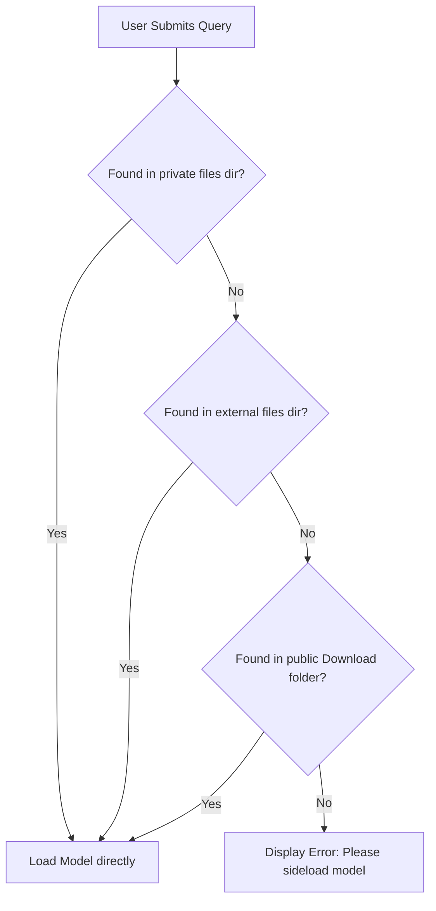

# Build and Asset Packaging Guide - Admission Counselor AI

This document details the Gradle multi-module layout, Google Play Asset Delivery (PAD) configurations, model asset downloading pipelines, and offline database provisioning logic.

---

### 1. Project Module Structure

The Android project is structured as a single-module Gradle project. By relying exclusively on direct file sideloading, the app avoids Google Play's APK size limits, eliminates split-module compilation, and avoids the 5.16 GB storage duplication penalty.

```
project-root/
│
├── build.gradle (Project level)
├── settings.gradle
│
└── app/ (Main application module)
    ├── build.gradle
    └── src/main/
        ├── assets/
        │   └── databases/
        │       └── admission.db (Offline database template)
        └── java/com/admission/counselor/ (Java/Kotlin Source)
```

---

## 2. Model Sideloading and Gradle Configuration

The `gemma-4-E2B-it` model file is **2.58 GB** on-disk. To deliver this asset without network access (preserving the zero-network privacy mandate) and without duplicate disk usage, the app reads the model binary directly from the device's local file storage.

### 2.1 settings.gradle Configuration
The settings file only needs to include the main application module:

```groovy
// settings.gradle
pluginManagement {
    repositories {
        google()
        mavenCentral()
        gradlePluginPortal()
    }
}
dependencyResolutionManagement {
    repositoriesMode.set(RepositoriesMode.FAIL_ON_PROJECT_REPOS)
    repositories {
        google()
        mavenCentral()
    }
}
rootProject.name = "AdmissionCounselorAI"
include ':app'
```

### 2.2 app/build.gradle Configuration
Declare standard Android dependencies and Hilt. No Play Asset Delivery plugins or packaging dependencies are needed:

```groovy
// app/build.gradle
plugins {
    id 'com.android.application'
    id 'kotlin-android'
}

android {
    namespace 'com.admission.counselor'
    compileSdk 34

    defaultConfig {
        applicationId "com.admission.counselor"
        minSdk 29
        targetSdk 34
        versionCode 1
        versionName "1.0.0"
    }

    buildTypes {
        release {
            minifyEnabled true
            proguardFiles getDefaultProguardFile('proguard-android-optimize.txt'), 'proguard-rules.pro'
        }
    }
}

dependencies {
    // Standard dependencies
    implementation 'androidx.core:core-ktx:1.12.0'
    implementation 'androidx.lifecycle:lifecycle-runtime-ktx:2.7.0'
    implementation 'androidx.lifecycle:lifecycle-process:2.7.0'

    // Hilt Dependency Injection
    implementation 'com.google.dagger:hilt-android:2.51.1'
    kapt 'com.google.dagger:hilt-android-compiler:2.51.1'
    implementation 'androidx.hilt:hilt-navigation-compose:1.2.0'
}
```

---

## 3. Model Sideload Resolution and Loading Pipeline

At runtime, the app automatically checks several directories on the local device storage to locate the model binary. This check requires **no runtime storage permissions** if the model is sideloaded to app-specific directories.



### 3.1 Model Loader Implementation
The loader resolves the file path by scanning designated locations sequentially:

```kotlin
@Singleton
class ModelAssetLoader @Inject constructor(
    @ApplicationContext private val context: Context
) {
    fun resolveModelPath(): Result<String> {
        // Location 1: App private storage (filesDir)
        val privateFile = java.io.File(context.filesDir, "gemma-4-E2B-it.litertlm")
        if (privateFile.exists() && privateFile.length() > 2_000_000_000L) {
            return Result.success(privateFile.absolutePath)
        }

        // Location 2: Scoped external app storage (no runtime permissions needed)
        // Path: /sdcard/Android/data/com.admission.counselor/files/gemma-4-E2B-it.litertlm
        val extFilesDir = context.getExternalFilesDir(null)
        if (extFilesDir != null) {
            val extFile = java.io.File(extFilesDir, "gemma-4-E2B-it.litertlm")
            if (extFile.exists() && extFile.length() > 2_000_000_000L) {
                return Result.success(extFile.absolutePath)
            }
        }

        // Location 3: Public Download folder
        // Path: /sdcard/Download/gemma-4-E2B-it.litertlm
        val downloadFolder = android.os.Environment.getExternalStoragePublicDirectory(
            android.os.Environment.DIRECTORY_DOWNLOADS
        )
        val downloadFile = java.io.File(downloadFolder, "gemma-4-E2B-it.litertlm")
        if (downloadFile.exists() && downloadFile.length() > 2_000_000_000L) {
            return Result.success(downloadFile.absolutePath)
        }

        return Result.failure(
            IllegalStateException(
                "Model file 'gemma-4-E2B-it.litertlm' not found. Please sideload the model to 'Download' or the app's files directory."
            )
        )
    }
}
```

### 3.2 Pre-compiled XNNPACK Cache Sideloading
To avoid initial compilation pauses (which take 10+ seconds for a 2.58 GB model on first-run), developers can sideload the precompiled cache file (`.xnnpack_cache` companion) directly next to the model weights file. At runtime, the LiteRT-LM engine detects the companion cache file and loads compiled kernels instantly.

## 4. SQLite Database Provisioning (First Run Seeding)

The static database templates (`admission.db`) are compiled directly into the main app assets directory. Room's `createFromAsset()` handles the first-run copy from the read-only `/assets/` folder to the app's writable databases directory automatically.

### 4.1 Database Seeding Pipeline Steps

| Step | Operation Details | File Path Mappings |
| :--- | :--- | :--- |
| **1. Seed Verification** | Room checks if the target database file already exists in the private databases directory. | Checks: `/data/user/0/com.admission.counselor/databases/admission.db` |
| **2. Asset Copy** | If no database exists, Room copies the pre-built template from the asset bundle. | Reads from: `app/src/main/assets/databases/admission.db` |
| **3. Sandbox Writing** | Room streams the data into the sandbox location and verifies integrity. | Writes to: `/data/user/0/com.admission.counselor/databases/admission.db` |
| **4. Encryption** | Android File-Based Encryption (FBE) encrypts the database at rest automatically. No application-level encryption step is required. | Managed by Android OS, no explicit path. |
