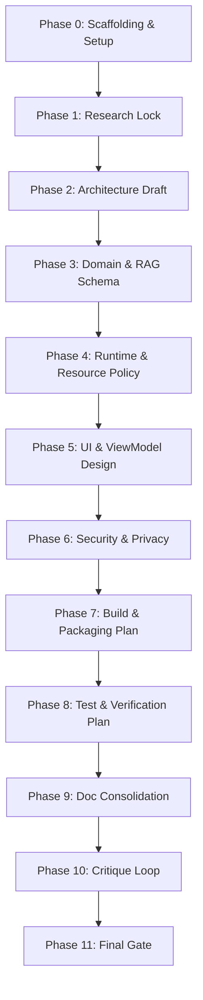

# Loop-Engineering Rules

This document outlines the workflow, role-play mechanics, phase definitions, and verification criteria for the Admission Counselor AI specification repository.

## Workflow Overview
We operate as a multi-layered, loop-based specification engineering system. No production code is implemented during this project. The system architecture relies on three nested loops:

1. **Inner Loop (Verification)**: Local edit -> self-critique pass -> cross-file verification. Runs continuously during file drafting.
2. **Middle Loop (Workflow)**: Phase progression. Phase Objective -> Implementation Plan approval -> Execution -> Archiving -> User Phase Gate. Runs across the 12 sequential phases.
3. **Outermost Loop (Research & Adaptation)**: Telemetry and process optimization. The system logs metrics (tokens, tool calls, context size, and user edit distance) in [LOOP-LOG.md](file:///d:/Github/android-llm/specs/LOOP-LOG.md). These metrics are analyzed to dynamically update loop rules, target specifications, and roles, building a dataset for academic research.

> [!IMPORTANT]
> **Human-in-the-Loop Phase Gate**: We must stop and wait for human input/approval at the end of each phase before commencing work on the next phase.

---

## Team Roles & Simulations
To ensure high fidelity and comprehensive review, we simulate the following roles throughout the workflow:

| Role | Responsibility |
| :--- | :--- |
| **Planner** | Organizes priorities, manages phase milestones, and updates the task tracking board. |
| **Researcher** | Retrieves facts, API documentation, and edge device benchmark details (e.g., LiteRT-LM limits). |
| **Architect** | Designs structural patterns, data flows, thread handling, and sandboxing models. |
| **Spec Writer** | Drafts and refines the technical documents, diagrams, and schema definitions. |
| **Critic** | Reviews drafts for vagueness, loopholes, inconsistencies, and violations of repo limits. |
| **Verifier** | Validates traceability of requirements to designs, and checks that files are mutually consistent. |

---

## Phase Definitions & Gates

The specification development progresses through these sequential phases:

### Phase Details

#### Phase 0: Repo Scaffolding and Spec Folder Setup
* **Objective**: Initialize the repository folders, create base tracking files (`AGENTS.md`, `README.md`, `LOOP-RULES.md`, `ISSUES.md`, `tasks/TASKS.md`, `LOOP-LOG.md`).
* **Gate**: Verification of all initial files, no placeholder text, and user approval of Phase 0 scaffolding.

#### Phase 1: Research Lock (LiteRT-LM & E2B Performance Parameters)
* **Objective**: Confirm LiteRT-LM compatibility, memory usage for `gemma-4-E2B-it` (2.58 GB), GPU delegate requirements, and thermal constraints.
* **Gate**: Locked down architecture assumptions backed by documented reference sources.

#### Phase 2: Architecture Draft (Single-App & Threading Model)
* **Objective**: Define thread containment models, Kotlin Coroutines setup for background inference, and single-session lock implementation.
* **Gate**: Non-blocking main thread flow diagrams and lock/semaphore designs.

#### Phase 3: Domain Context and RAG Schema Draft
* **Objective**: Define structured schemas for university data, course catalogues, fees, and retrieval logic.
* **Gate**: Documented JSON/SQLite/Protocol Buffer schemas.

#### Phase 4: Model Runtime and Resource Policy Draft
* **Objective**: Define CPU/GPU delegate usage rules, thermal throttling handling, low-memory (LOMEM) handling, and model unloading.
* **Gate**: Concrete policies mapping system states to model lifetime commands.

#### Phase 5: App UI and ViewModel Design Draft
* **Objective**: Draft ViewModel state-machine diagrams, Jetpack Compose layouts, stream handling, and error states.
* **Gate**: UI flow contract mapping user intents to model actions.

#### Phase 6: Security, Data Privacy, and Sandboxing Model
* **Objective**: Sandbox user prompt histories, manage storage isolation for the model asset, and detail privacy policies.
* **Gate**: Clear storage mapping and permission requirements.

#### Phase 7: Build and Asset Packaging Plan
* **Objective**: Address packaging the 2.58 GB model asset. Define APK size limits, Play Asset Delivery (PAD) or post-install download strategies.
* **Gate**: Detailed build guide specifying asset locations and gradle targets.

#### Phase 8: Test and Verification Plan
* **Objective**: Plan instrumentation tests, performance profiling, and memory leak analysis.
* **Gate**: Test plans covering load times, memory utilization, and response latencies.

#### Phase 9: Documentation Consolidation
* **Objective**: Populate and cross-reference all specifications, verifying consistency.
* **Gate**: Complete draft of all `/specs` files.

#### Phase 10: Critique and Consistency Loop
* **Objective**: Perform a comprehensive cross-reference audit to detect any m-dashes, missing links, or discrepancies.
* **Gate**: A clean critique report and updated issues list.

#### Phase 11: Final Verification Gate
* **Objective**: Final traceability audit and verification check.
* **Gate**: Complete requirement-to-file traceability, ready for developer execution.

---

## Phase Execution Checklist
At each phase, the model must execute the following workflow steps:

1. **State Phase Objective**: Clarify the goal of the current phase.
2. **List Affected Files**: List all files under `/specs` that will be modified or created.
3. **Write or Revise**: Implement changes following the Quality Rules.
4. **Critique Pass**: Run a self-critique (Critique Role) on the updated documents to identify contradictions, vague specs, or unverified assumptions.
5. **Verify Pass**: Confirm cross-file consistency (Verifier Role) and trace requirements.
6. **Log Issues**: Record all unresolved issues and gaps in [ISSUES.md](file:///d:/Github/android-llm/specs/ISSUES.md).
7. **Update Tasks**: Populate [tasks/TASKS.md](file:///d:/Github/android-llm/specs/tasks/TASKS.md) with the tasks for the subsequent phase.
8. **Pause**: Signal Phase Completion and wait for user approval to proceed.
9. **Archive Phase State**: Upon user approval of the phase completion, copy the current state of the Antigravity artifacts (`implementation_plan.md`, `walkthrough.md`, `task.md`) and all modified `/specs` files to the `specs/history/` directory using the filename format `Phase-[X]-[filename].md` (where `[X]` is the completed phase number). This maintains an evolutionary log of the loop-engineering methodology.
