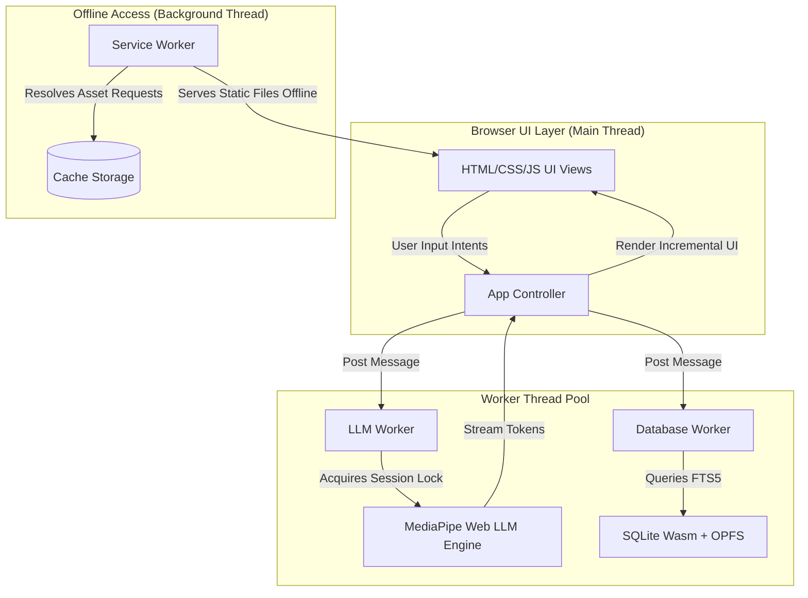

# PWA Architecture Specification - Admission Counselor AI

This document defines the Progressive Web App (PWA) architecture, the client-side background execution model using Web Workers, and the SQLite Wasm database configuration with Origin Private File System (OPFS) backing for the offline-first web engine.

**Document Date**: June 19, 2026

---

## 1. Application System Topology

The PWA runs entirely in the client browser environment. To prevent UI blocking during massive token calculations, the application offloads both database operations and model inference to Web Workers.



---

## 2. Storage Strategy and Database Configuration

To maintain consistency with the Android implementation, the PWA utilizes SQLite Wasm with OPFS backing rather than IndexedDB or browser cache for the RAG guidelines database.

### 2.1 SQLite Wasm with OPFS
SQLite Wasm compiles SQLite into WebAssembly and enables developers to interface with the browser's high-performance Origin Private File System (OPFS).
- **Direct File Manipulation**: SQLite writes and reads blocks directly from OPFS, preserving the FTS5 virtual tables and execution speeds.
- **Data Persistence**: The SQLite file remains persisted across browser sessions and tab closes, accessible only by the PWA origin.

### 2.2 Database Initialization Flow
1. On first application startup, the Service Worker detects if the SQLite database is cached.
2. The Database Worker retrieves the `admission.db` binary seed from the app's assets folder via a standard `fetch` call (if not cached).
3. The binary is written to the OPFS root directory.
4. Subsequent database operations connect directly to the local OPFS database path (`opfs:/admission.db`).

---

## 3. Threading and Worker Model

To maintain 60 frames per second UI rendering, all CPU-heavy tasks are isolated to separate background worker threads.

| Thread / Worker | Context | Responsibility |
| :--- | :--- | :--- |
| **Main Thread** | DOM Window | Handles UI interactions, renders chat tokens, updates CSS variables, coordinates state. |
| **Service Worker** | ServiceWorkerGlobalScope | Intercepts network requests, serves static HTML/JS/CSS assets and WASM binary wrappers offline. |
| **LLM Worker** | WorkerGlobalScope | Instantiates MediaPipe Web LLM Inference engine, loads model weights from OPFS, handles token generation. |
| **Database Worker** | WorkerGlobalScope | Initialises SQLite WASM, manages OPFS connections, and executes FTS5 queries for RAG context extraction. |

---

## 4. Local Model Execution and WebGPU Acceleration

The PWA executes the 2.58 GB `gemma-4-E2B-it` model client-side. WebGPU is required for acceptable response times.

### 4.1 WebGPU Engine Configuration
MediaPipe Web LLM Inference API utilizes WebGPU to access the client graphics hardware directly:
- **WebGL Fallback**: Devices lacking WebGPU will fall back to WebGL 2.0 or WASM CPU execution, which may result in slow generation times.
- **OPFS Model Cache**: Due to the size of the 2.58 GB weights file, the Web Worker checks OPFS for cached `.bin` chunks first before prompting the user for an import or downloading, reducing load times on launch.

### 4.2 Web Worker Message Interface
The main controller communicates with workers using standard JSON message passing (`postMessage`):

```javascript
// Example Main-to-LLM-Worker generation message
worker.postMessage({
    type: "GENERATE",
    payload: {
        prompt: "<start_of_turn>user\n[CONTEXT]\n...\n[QUERY]\n...\n<end_of_turn>\n<start_of_turn>model"
    }
});
```

---

## 5. Lifecycle and Memory Containment

Browsers enforce aggressive tab discarding when RAM consumption exceeds thresholds or a tab remains hidden. The PWA adopts strict resource release policies to prevent browser-enforced crashes.

### 5.1 Visibility State Monitoring
The app tracks tab visibility using the Page Visibility API (`document.visibilityState`):
- **Tab Hidden (Background)**: Start a 30-second countdown. If the tab is not returned to focus within 30 seconds, a post message is sent to the LLM worker to terminate the MediaPipe instance and free WebGPU memory.
- **Tab Visible (Foreground)**: If the engine was unloaded, the app triggers a background warm-up of the Web Worker, prepping the model weights loader.

### 5.2 Browser Memory Trim (Inactivity Timer)
- **Idle Timeout**: If no messages are exchanged for 5 minutes (300 seconds), the LLM Worker closes the active engine instance and frees WebGPU shaders.
- **OOM Prevention**: Before loading the 2.58 GB model, the PWA queries browser storage space using `navigator.storage.estimate()` to verify that at least 5.0 GB of disk space is available for OPFS cache.

---

## 6. Single Session Policy

The PWA worker rejects concurrent prompts during token streaming.

| Active Generation Status | Worker Reaction | UI Action |
| :--- | :--- | :--- |
| **Idle** | Process prompt, lock worker state. | Show loading indicator, stream text. |
| **Generating** | Reject incoming message with `BUSY` status. | Display a "Counselor is busy formulating a response" message to the user. |
