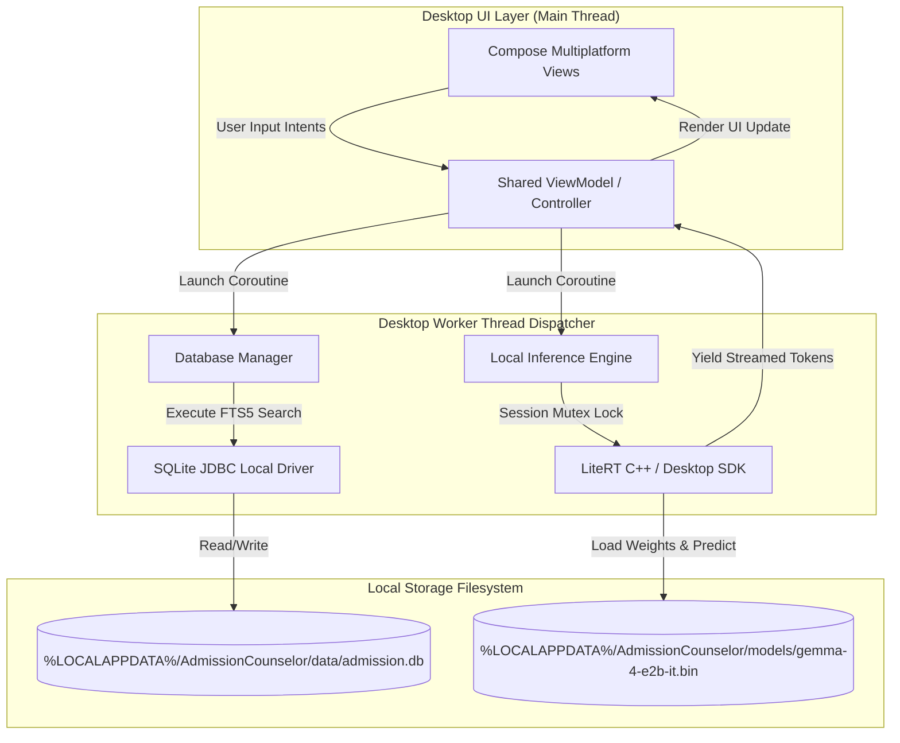
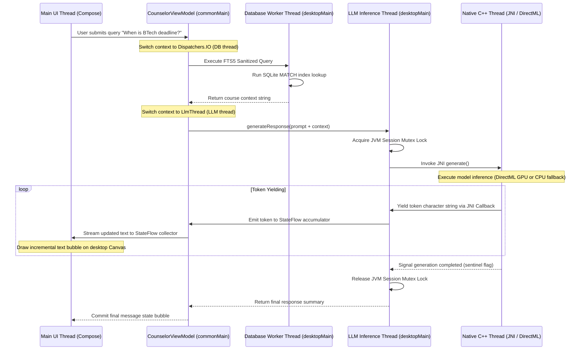

# Windows Architecture Specification - Admission Counselor AI

This document defines the Windows Desktop App architecture, the multiplatform sharing model using Compose Multiplatform, local CPU/GPU execution constraints, and the SQLite local database integration.

**Document Date**: June 21, 2026

---

## 1. Application System Topology

The Windows application is built as a desktop client targeting the Java Virtual Machine (JVM). To maintain high layout portability and logic reuse, the application uses Kotlin Multiplatform (KMP) and Compose Multiplatform for Desktop.



### 1.1 Multiplatform Code-Sharing Model
The project architecture leverages a shared Kotlin Multiplatform library to maximize code reuse:
- **`commonMain` (Shared Module)**:
  - **ViewModels**: Coordinates conversational state transitions, handles incremental StateFlow token accumulator streams, and stores active chat message structures.
  - **RAG Context Builders**: Runs FTS5 query token sanitization (stripping operators, removing stopwords) and builds structured prompt text blocks within the 4096 context window limit.
  - **Domain Entities**: Defines data classes for course data catalogs and chat message schema objects.
- **`androidMain` (Android Target)**:
  - **LocalLlmEngine**: Integrates directly with LiteRT Android library using GPU delegates and PowerManager thermal listeners.
  - **Database**: Implements Android Room Database with Android File-Based Encryption (FBE).
- **`desktopMain` (Windows Desktop Target)**:
  - **LocalLlmEngine**: Coordinates dynamic library bindings (`LlmInferenceJni.dll`) supporting local DirectML GPU/XNNPACK CPU prioritized execution fallback, or Gemini API Client.
  - **Database**: Implements native JVM SQLite JDBC local connection driver.

---

## 2. Storage Strategy and Database Configuration

The database configuration on Windows mirrors the Android implementation to guarantee offline parity.

### 2.1 SQLite Local JDBC Driver
The application integrates the local SQLite JDBC driver inside the desktop JVM runtime.
- **Data Location**: On the first start, the application resolves the persistent user directory:
  `%LOCALAPPDATA%\AdmissionCounselor\data\`
- **Database Cloning**: The application copies the packaged database template (`admission.db`) from its local distribution assets directory to `%LOCALAPPDATA%\AdmissionCounselor\data\admission.db`.
- **FTS5 Indexes**: Matches all SQLite FTS5 search query structures, tokenization rules, and stopwords queries designed for Android.

### 2.2 Shared Weights Loader
- The `gemma-4-E2B-it` (2.58 GB) weights file resides in `%LOCALAPPDATA%\AdmissionCounselor\models\`.
- To avoid copying massive files, the UI provides a settings tab allowing the user to select the weights file location from another directory (e.g., sharing the Android sideloaded directory or downloads folder) using the native OS file picker (`AWT FileDialog` or `JFileChooser`).

### 2.3 Windows Database Seeding & Update Flow
To copy and update the local SQLite database template seed securely on Windows environments:
1. **Initial Replication**: On startup, the app checks if `%LOCALAPPDATA%\AdmissionCounselor\data\admission.db` exists. If not, it reads the template binary packaged as a JAR resource (`/assets/admission.db`) via JRE `Class.getResourceAsStream()`, copy-streams it to the target directory, and verifies integrity using a SHA-256 hash comparison.
2. **Dynamic Update Inspection**: The packaged JAR resource contains a metadata tag specifying database schema version.
3. **Version Check Verification**: On startup, the application queries the SQLite `PRAGMA user_version` on both the active database and the packaged resource database:
   - If the JAR template `user_version` exceeds the local file's `user_version`, the app flags a database update.
   - The app backs up the active local file to `admission.db.bak` and copy-overwrites it with the new JAR resource template database.
   - The local FTS5 search virtual indexes are automatically rebuilt on the new database template during the copy operation.

---

## 3. Threading and Concurrency

To ensure the UI remains responsive, all compute-heavy operations (database search and token generation) are dispatched off the main thread.

| Component | Execution Context | Platform Threading |
| :--- | :--- | :--- |
| **Main UI Thread** | Compose Multiplatform Thread | Handles rendering updates, drawing text streams, and interactive desktop events. |
| **LlmEngine Background Dispatcher** | Custom single-threaded Dispatcher (`Dispatchers.IO` wrapper) | Executes local inference predictions, loads weights files, and processes raw text token strings. |
| **Database Worker Dispatcher** | Custom Dispatcher wrapper | Processes SQLite FTS5 queries and compiles retrieved program context records. |

### 3.1 Session Mutex Lock
To prevent prompt collisions, a JVM-level `Mutex` lock is acquired during active generation sessions:
- If a new prompt is received while another is processing, the worker rejects the input with an engine status of `BUSY`.
- The UI handles the `BUSY` status by showing a non-intrusive notification.

### 3.2 Desktop Thread Dispatching and Context Switching Flow
The flow of execution context during a student query transaction is strictly isolated to protect the UI thread and native boundaries:



---

## 4. Local Model Execution and Acceleration

The desktop application executes the 2.58 GB `gemma-4-E2B-it` model locally or fallbacks to cloud endpoints depending on hardware and key availability.

### 4.1 Prioritized Execution (GPU, Cloud API, CPU Fallback)
To achieve the best possible performance while ensuring broad device compatibility, the engine follows a strict prioritized execution order:
- **Priority 1: Local GPU Acceleration**: If a compatible DirectX 12 GPU is detected (via DirectML or Vulkan delegates), the engine loads the model locally on the GPU. This targets optimal throughput (>10 tokens/second).
- **Priority 2: Cloud API Client**: If local GPU hardware is missing, but a valid Cloud API Key (e.g., Gemini API) is supplied/configured in the app settings, the application routes the prompt to the cloud endpoint to maintain rapid generation speeds.
- **Priority 3: Local CPU Execution (Fallback)**: If no GPU is detected and no API keys are provided, the engine runs the model locally on the CPU using multi-threaded XNNPACK. Although execution will be slow (e.g., <2 tokens/second), it guarantees complete offline availability.

### 4.2 LiteRT Desktop Engine & JNI Bindings
Because LiteRT does not ship with a pre-packaged JVM desktop jar, the application links to a custom native library wrapper (`LlmInferenceJni.dll`) exposing the C/C++ LiteRT API via JNI:
- **Linkage Protocol**: Kotlin views local LLM calls via a `LocalLlmEngine` interface which communicates with native bindings:
  ```kotlin
  object LlmInferenceJni {
      init {
          System.loadLibrary("LlmInferenceJni")
      }
      external fun initialize(modelPath: String, useGpu: Boolean): Long
      external fun generate(handle: Long, prompt: String, callback: TokenCallback): Unit
      external fun cancel(handle: Long): Unit
      external fun close(handle: Long): Unit
  }
  ```
- **Error Handling**: JNI throws structured `RuntimeException` calls to the JVM if the dynamic library fails to load the weights file or if VRAM allocation fails during engine setup.

### 4.3 DirectML GPU Delegate Configuration
To leverage DirectML on Windows systems, the native runtime configures a DirectX 12 execution context:
- **Adapter Selection**: The native engine uses `IDXGIFactory4` to enumerate available DX12 adapters, prioritizing dedicated hardware GPUs over integrated chips.
- **DirectML Options**:
  ```cpp
  TfLiteDirectMlDelegateOptions options = {};
  options.disable_metacommands = false; // Enable optimized hardware-specific shader kernels
  TfLiteDelegate* dml_delegate = TfLiteDirectMlDelegateCreate(&options);
  ```
- **Shader Cache**: The engine saves compiled GPU shader kernels to `%LOCALAPPDATA%\AdmissionCounselor\cache\dml_kernels.bin` to reduce the startup time on subsequent launches.

### 4.4 Cloud API Client & Fallback Mechanics
When local GPU hardware is missing and a Cloud API Key is present in the app settings:
- **Fallback Trigger**:
  ```kotlin
  val isGpuAvailable = GPUDetector.isDirectX12Supported()
  val apiKey = ConfigManager.getApiKey()
  
  val activeEngine = when {
      isGpuAvailable -> LocalGpuEngine()
      apiKey.isNotBlank() -> CloudApiEngine(apiKey)
      else -> LocalCpuEngine()
  }
  ```
- **Payload Schema**: Calls utilize the official Gemini API REST endpoint:
  `POST https://generativelanguage.googleapis.com/v1beta/models/gemini-1.5-flash:generateContent?key={API_KEY}`
- **Security Sandboxing**: The API Key is encrypted using Windows Data Protection API (DPAPI) and stored in `%LOCALAPPDATA%\AdmissionCounselor\config\settings.json`.
- **Network Failure Fallback**: If the `CloudApiEngine` generation call fails (e.g., due to lack of network connection or invalid API credentials), the session automatically falls back to `LocalCpuEngine` to preserve client-side responsiveness.

### 4.5 CPU XNNPACK Multi-Threading & Fallback Optimization
For Priority 3 CPU execution, the engine optimizes the execution graph for the host processor:
- **Thread Count Budget**: To avoid laptop CPU core starvation and thermal throttling, the engine calculates the thread count:
  `num_threads = min(4, max(1, logical_cores / 2))`
- **XNNPACK Configuration**: Enable sparse tensor operations and fast floating-point calculations to maximize output generation rate.

### 4.6 Memory Allocation & RAM Budget
To prevent host memory exhaustion, runtime memory limits are strictly controlled:

| Memory Segment | Allocation Mode | Limit (CPU Mode) | Limit (GPU Mode) | Target Description |
| :--- | :--- | :--- | :--- | :--- |
| **JVM Heap** | Static Garbage Collector Ceiling | 512 MB | 512 MB | Volatile user interface rendering and Compose layout nodes. |
| **Native LiteRT Engine** | Memory-mapped C++ memory | 2.58 GB | 100 MB | Dynamic model execution graph. MAP_SHARED ensures low overhead. |
| **KV Cache Buffer** | Native dynamic allocation | 200 MB | 200 MB | History buffer holding context up to 4096 tokens. |
| **DirectML GPU Memory** | VRAM / System Shared VRAM | 0 MB | 2.80 GB | Model weight buffers copy and active GPU tensor buffers. |
| **Combined Target RSS** | Process Resident Set Size | ~3.38 GB | ~3.68 GB | Maximum allowed process memory footprint during generation. |

---

## 5. Lifecycle and Memory Containment

Unloading unused assets from memory prevents excessive RAM usage on host systems.

### 5.1 Window Focus and Lifecycle Listeners
Compose Multiplatform exposes application-level window listeners:
- **Minimization Event**: If the application window is minimized or remains in the background for more than 30 seconds, the runtime unloads the LiteRT inference session, releasing CPU threads and system RAM.
- **Restoration Event**: Restoring the window triggers a background re-warmup of the engine, ensuring the model is ready when the user types a new prompt.
- **Close Event**: Terminating the application immediately executes the native C++ release destructors to free RAM before exiting the process.

### 5.2 Heap Control Limits
The JVM launch parameters restrict heap size limits (`-Xmx512M`) to force the garbage collector to clean up UI allocations, keeping the combined Java Heap and C++ native memory allocations within a 3.5 GB system limit.
