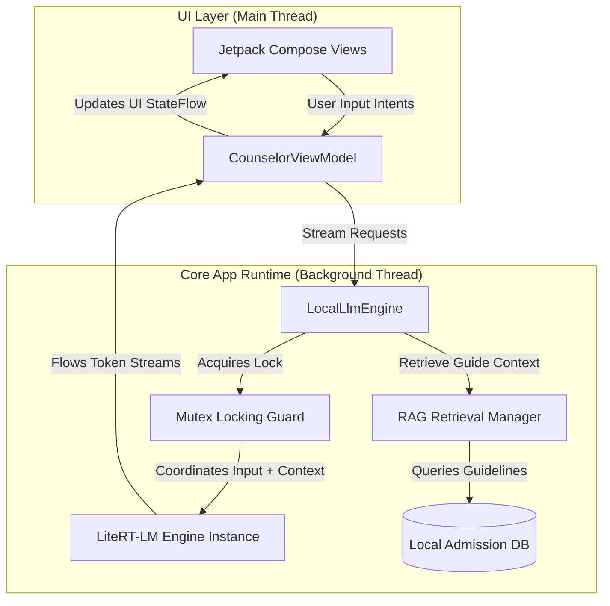
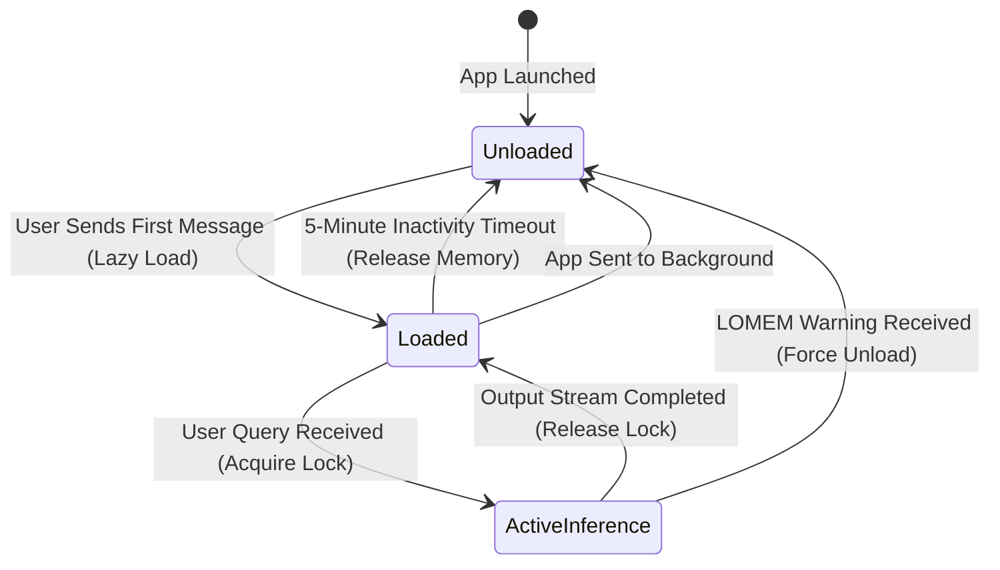

# Architecture Specification - Admission Counselor AI

This document defines the standalone application architecture, the Kotlin Coroutines background threading containment model, and the mutual exclusion locking patterns for the LiteRT-LM inference engine.

---

## 1. Application System Topology

The Admission Counselor AI platform runs entirely within a single standalone Android application boundary. The application does not require any cross-app Inter-Process Communication (IPC) or Android Interface Definition Language (AIDL) bindings.



---

## 2. Background Threading and Concurrency Model

### 2.1 Thread Containment
To keep the Main UI thread free of performance bottlenecks, all model lifecycle commands (loading, token generation, and unloading) must execute on a dedicated background thread. 

We use Kotlin Coroutines for lightweight thread containment.

### 2.2 Execution Dispatchers

| Dispatcher Target | Thread Binding | Core Usage |
| :--- | :--- | :--- |
| `Dispatchers.Main` | Main UI Thread | UI rendering, Compose layout updates, ViewModel state observation. |
| `LlmDispatcher` | `newSingleThreadContext("LlmThread")` | Sequential execution of all model load, stream, and unload commands. |
| `Dispatchers.IO` | Thread Pool (IO) | Local database queries, file system access, and RAG indexing operations. |

---

## 3. Mutual Exclusion & Concurrency Control

The LiteRT-LM `LlmInference` runtime engine is not thread-safe. Overlapping calls to model generation or context resets will crash the process or cause severe Out-of-Memory spikes on-device.

### 3.1 Mutex Locking Implementation
We enforce a strict single active session constraint using a Kotlin Coroutines `Mutex`. Every transaction with the `LlmInference` instance must be wrapped within a `withLock` block.

```kotlin
class LocalLlmEngine(
    private val context: Context,
    private val llmDispatcher: CoroutineDispatcher
) {
    // Enforces single-session access across all coroutines
    private val sessionMutex = Mutex()
    private var inferenceEngine: LlmInference? = null

    suspend fun generateResponse(prompt: String): Flow<String> = flow {
        // Enforce mutual exclusion
        sessionMutex.withLock {
            val engine = getOrInitializeEngine()
            
            // Channel for stream output bridging LiteRT callbacks to Kotlin Flow
            val channel = Channel<String>(Channel.UNLIMITED)
            
            engine.generateAsync(prompt) { token, error ->
                if (error != null) {
                    channel.close(error)
                } else if (token != null) {
                    channel.trySend(token)
                }
            }
            
            for (token in channel) {
                emit(token)
            }
        }
    }.flowOn(llmDispatcher)
    
    private suspend fun getOrInitializeEngine(): LlmInference = withContext(llmDispatcher) {
        if (inferenceEngine == null) {
            val options = LlmInference.LlmInferenceOptions.builder()
                .setModelPath("/data/user/0/com.admission.counselor/files/gemma-4-E2B-it.litertlm")
                .setTemperature(0.2f)
                .setTopK(40)
                .setMaxTokens(1024)
                .build()
            inferenceEngine = LlmInference.createFromOptions(context, options)
        }
        inferenceEngine!!
    }
}
```

---

## 4. Single active session enforcement policy

When a user initiates an inference request while the engine is already generating a response, the system enforces a non-queuing busy policy.

| Concurrent Request State | System Action | UI Presentation |
| :--- | :--- | :--- |
| **Engine Idle** | Acquire lock and begin generating tokens. | Render text tokens incrementally in chat bubbles. |
| **Engine Busy (Active Generating)** | Reject new request immediately without queueing. | Display a "Counselor is busy formulating a response" warning toast or banner. |

---

## 5. Lifecycle and Memory Management

Running a 2.58 GB model on mid-range Android devices requires aggressive memory management.



### 5.1 Idle Timeout Unloading
To prevent the application from keeping 2.58 GB of RAM locked up indefinitely:
1. The engine tracks the timestamp of the last generated response.
2. An inactivity job polls every 60 seconds.
3. If 5 minutes pass without active user interaction, the engine calls `inferenceEngine.close()`, sets the pointer to `null`, and triggers `System.gc()` to encourage immediate RAM reclamation.

### 5.2 Background Lifecycle Events
- **OnPause/OnStop**: When the Android Activity goes into the background, the engine is paused.
- **OnDestroy**: If the app is swiped away or closed, the engine must release the model allocation in its `onDestroy` lifecycle method.
- **Low Memory (LOMEM)**: When `onTrimMemory(TRIM_MEMORY_RUNNING_CRITICAL)` is invoked by the Android OS, the engine forces an immediate close and release, cancelling any active generations.
