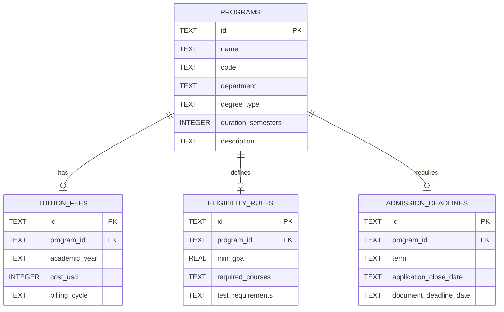

# Counselor Context Schemas - Admission Counselor AI

This document defines the on-device database schemas, Full-Text-Search indexing patterns, RAG retrieval workflows, token budgeting parameters, and prompt templates for context injection.

---

## 1. Local Database Strategy

The application operates entirely offline. To support fast, query-based retrieval without server infrastructure, the app stores university admission data in a local **SQLite** database.



---

## 2. SQLite Database Schemas

### 2.1 Primary Tables

#### `programs`
Defines the academic course offerings.

| Column | Type | Constraints | Description |
| :--- | :--- | :--- | :--- |
| `id` | TEXT | PRIMARY KEY | Unique UUID identifier for the program. |
| `name` | TEXT | NOT NULL | Full name of the program. |
| `code` | TEXT | NOT NULL, UNIQUE | Program identification code (e.g., BSCS). |
| `department` | TEXT | NOT NULL | Academic department. |
| `degree_type` | TEXT | NOT NULL | Degree awarded (e.g., Bachelor, Master). |
| `duration_semesters` | INTEGER | NOT NULL | Total duration in semesters. |
| `description` | TEXT | NOT NULL | Description of the curriculum. |

#### `tuition_fees`
Tracks program-specific costs.

| Column | Type | Constraints | Description |
| :--- | :--- | :--- | :--- |
| `id` | TEXT | PRIMARY KEY | Unique UUID identifier. |
| `program_id` | TEXT | FOREIGN KEY REFERENCES programs(id) | Linked program. |
| `academic_year` | TEXT | NOT NULL | Target year (e.g., 2026/2027). |
| `cost_usd` | INTEGER | NOT NULL | Annual or semester tuition cost in USD. |
| `billing_cycle` | TEXT | NOT NULL | Billing frequency (e.g., Semester, Annual). |

#### `eligibility_rules`
Defines programmatic admission requirements.

| Column | Type | Constraints | Description |
| :--- | :--- | :--- | :--- |
| `id` | TEXT | PRIMARY KEY | Unique UUID identifier. |
| `program_id` | TEXT | FOREIGN KEY REFERENCES programs(id) | Linked program. |
| `min_gpa` | REAL | NOT NULL | Minimum cumulative GPA required (4.0 scale). |
| `required_courses` | TEXT | NOT NULL | Semi-colon separated list of required classes. |
| `test_requirements` | TEXT | NOT NULL | Standardized test minimum scores (SAT/ACT). |

#### `admission_deadlines`
Tracks application terms and critical cutoffs.

| Column | Type | Constraints | Description |
| :--- | :--- | :--- | :--- |
| `id` | TEXT | PRIMARY KEY | Unique UUID identifier. |
| `program_id` | TEXT | FOREIGN KEY REFERENCES programs(id) | Linked program. |
| `term` | TEXT | NOT NULL | Target academic semester (e.g., Fall 2026). |
| `application_close_date` | TEXT | NOT NULL | Final day to submit applications (YYYY-MM-DD). |
| `document_deadline_date` | TEXT | NOT NULL | Final day to upload credentials (YYYY-MM-DD). |

---

## 3. Search and Retrieval (RAG) Architecture

### 3.1 Full-Text-Search Virtual Table
To allow fast textual searches on program descriptions and requirements, the system builds an SQLite FTS5 virtual table.

```sql
-- Create FTS5 Virtual Table for program data search
CREATE VIRTUAL TABLE program_search_fts USING fts5(
    program_id UNINDEXED,
    name,
    code,
    description,
    eligibility_summary,
    deadline_summary
);
```

### 3.2 Context Retrieval Workflow
1. **User Query Input**: The user inputs a query (e.g., "What are the SAT requirements for Computer Science?").
2. **Search Query Execution**: The app executes a match query on the FTS5 table:
   ```sql
   SELECT program_id, name, description 
   FROM program_search_fts 
   WHERE program_search_fts MATCH :user_query 
   LIMIT 2;
   ```
3. **Entity Join Query**: The database manager pulls corresponding fees, requirements, and deadlines for the matched `program_id` records using standard joins.
4. **Context Construction**: Join results are compiled into a compact text block.

---

## 4. Token Budgeting and KV Cache Allocation

To avoid running out of RAM (OOM) and maintain generation throughput, the system enforces a strict 2048 token window budget for each inference.

| Context Segment | Token Budget | Character Limit (Approx) | Description |
| :--- | :--- | :--- | :--- |
| **System Prompt** | 250 tokens | 1000 characters | Enforces role-play, output formatting rules, and safety boundaries. |
| **Retrieved Context (RAG)**| 800 tokens | 3200 characters | Structured records retrieved from SQLite (caps context block size). |
| **Conversational History** | 500 tokens | 2000 characters | Prevents memory growth during long chats (rolling window of last 3 turns). |
| **User Input Query** | 150 tokens | 600 characters | Maximum length of current prompt (longer inputs truncated). |
| **Model Generation Budget**| 348 tokens | 1400 characters | Allocated for the generated counselor answer. |
| **Total Context Window** | **2048 tokens** | **8200 characters** | **Strict LiteRT-LM window limit.** |

---

## 5. Prompt Formatting and Context Injection

We use standard Gemma chat format tags (`<start_of_turn>` and `<end_of_turn>`) to inject retrieved context into the model's runtime block.

### 5.1 Prompt Construction Template

```text
<start_of_turn>user
You are the official local College Admission Counselor. Answer the student's question based strictly on the provided validated university guidelines. If the guidelines do not contain the answer, state that you do not have that information. Do not fabricate answers.

[VALIDATED UNIVERSITY GUIDELINES]
Program: Bachelor of Science in Computer Science (Code: BSCS)
- Description: Core training in programming, algorithms, software engineering.
- Annual Tuition: $15,000 USD (Billing: Semester billing cycle)
- Requirements: Minimum GPA 3.2; Required coursework: AP Calculus, physics; Test criteria: SAT 1250 min.
- Fall 2026 Deadlines: Apply by 2026-03-01; Documents due by 2026-03-15.

Program: Bachelor of Science in Data Science (Code: BSDS)
- Description: Mathematics, statistic forecasting, machine learning models.
- Annual Tuition: $16,000 USD (Billing: Semester billing cycle)
- Requirements: Minimum GPA 3.0; Required coursework: AP Statistics; Test criteria: SAT 1200 min.
- Fall 2026 Deadlines: Apply by 2026-03-01; Documents due by 2026-03-15.

[CONVERSATION HISTORY]
Student: Hi, I'm interested in applying.
Counselor: Welcome! I can help you with course information, deadlines, eligibility criteria, and fee structures. Which program are you considering?

[STUDENT QUESTION]
What are the requirements for Computer Science?
<end_of_turn>
<start_of_turn>model
Based on the validated university guidelines, the requirements for the Bachelor of Science in Computer Science (BSCS) program are:
1. Minimum cumulative GPA of 3.2.
2. Required coursework: AP Calculus and physics.
3. Standardized test scores: A minimum SAT score of 1250.
<end_of_turn>
```
