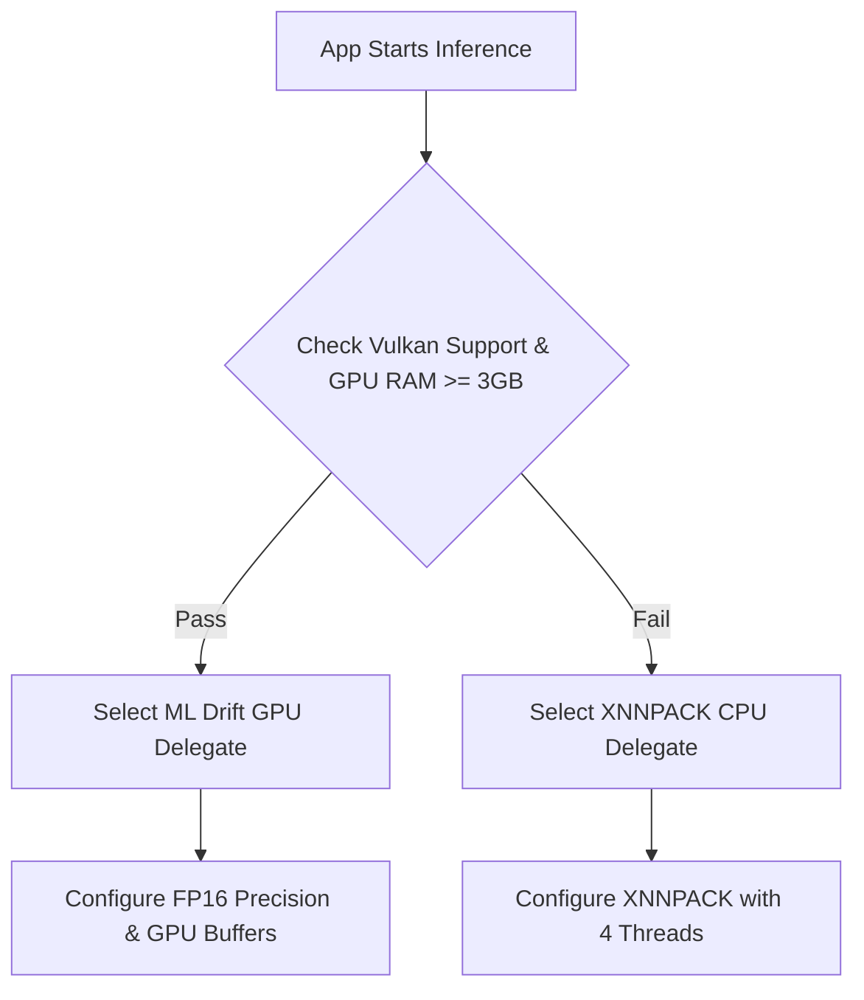
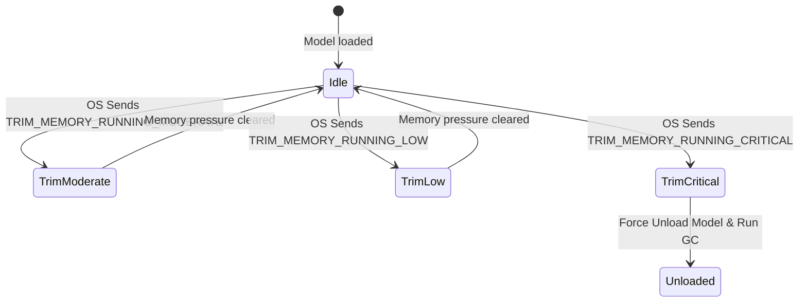

# Model Runtime and Resource Policy - Admission Counselor AI

This document establishes the hardware execution delegate selection rules, speculative decoding configurations, RAM lifecycle triggers, low-memory (LOMEM) handling, and thermal throttling mitigation policies.

---

## 1. Hardware Delegate Selection

To optimize inference speed while maintaining system stability, the LiteRT-LM engine dynamically selects the execution backend based on device capabilities.

### 1.1 Delegate Configuration Parameters

| Hardware Backend | LiteRT Delegate | Configuration Settings | Target Latency / Speed |
| :--- | :--- | :--- | :--- |
| **GPU Acceleration** | ML Drift | - FP16 precision enabled. - OpenGL/Vulkan command buffers enabled. | TTFT < 0.5 seconds. Throughput > 15 tokens/second. |
| **CPU Fallback** | XNNPACK | - 4 active execution threads. - Int8 quantized math acceleration. | TTFT < 1.5 seconds. Throughput > 5 tokens/second. |

---

## 2. Speculative Decoding (Multi-Token Prediction)

To achieve a 1.6x generation throughput boost, the system uses Speculative Decoding with Multi-Token Prediction (MTP).

### 2.1 Model Configurations
- **Target Model**: `gemma-4-E2B-it` (2.58 GB, 2 Billion parameters).
- **Drafter Model**: A compact 100 Million parameter drafter model (150 MB, `.litertlm` format).
- **Quantization**: Both models use 4-bit integer weights.

### 2.2 Execution Policy
- Speculative decoding is automatically enabled when running on the GPU backend (ML Drift) with available memory.
- Speculative decoding is disabled when the device is running on the CPU backend or under low-memory conditions to save RAM and CPU cycles.

---

## 3. Memory Lifecycle and low-memory (LOMEM) Triggers

The system monitors system-wide memory pressure and applies a tiered release strategy.

### 3.1 low-memory (LOMEM) Policy Table

| Android OS Signal | System State | Engine Response Action | UI Presentation |
| :--- | :--- | :--- | :--- |
| `TRIM_MEMORY_RUNNING_MODERATE` | System RAM starts tightening. | Truncate the rolling conversation history to the last 2 turns, shrinking the active KV cache. | No visible change. Chat remains seamless. |
| `TRIM_MEMORY_RUNNING_LOW` | System RAM is under high pressure. | - Clear conversation history from memory. - Disable speculative decoding (unload drafter model). | Display a subtle "Optimizing performance" status indicator. |
| `TRIM_MEMORY_RUNNING_CRITICAL` or `TRIM_MEMORY_COMPLETE` | Extreme memory shortage (OOM risk). | - Terminate active generation immediately. - Close `LlmInference` instance and release file descriptors. - Invoke JVM garbage collection (`System.gc()`). | Display a banner: "Counselor memory cleared to keep device stable. Tap to reload." |

---

## 4. Thermal Throttling Mitigation

Prolonged model generation generates heat. The app monitors device temperature via the Android `HardwarePropertiesManager` or battery status broadcasts to adjust the workload.

### 4.1 Thermal State Policies

| Thermal State | Device Temperature | Engine Policy Action | Expected Impact |
| :--- | :--- | :--- | :--- |
| **Normal** | Under 40 degrees Celsius | Run full speed with GPU acceleration and speculative decoding. | Standard performance: 15+ tokens/second. |
| **Warm** | 40 to 45 degrees Celsius | Introduce a 40ms pause delay between each generated token. | Reduces GPU utility by ~25% to control temperature rise. |
| **Throttled** | Over 45 degrees Celsius | - Disable speculative decoding. - Switch backend from GPU (ML Drift) to CPU (XNNPACK). | Throughput drops to ~5 tokens/second, but heat generation drops by 60%. |

---

## 5. Model Unloading and Idle Lifetime

- **Idle Grace Period**: The app maintains the model in memory for exactly 5 minutes (300 seconds) after the last query completes.
- **Inactivity Release**: If the idle grace period expires, or if the user places the app in the background (triggered by `Lifecycle.Event.ON_STOP`), the system runs a teardown task that releases the `LlmInference` resource and frees the 2.58 GB RAM.
