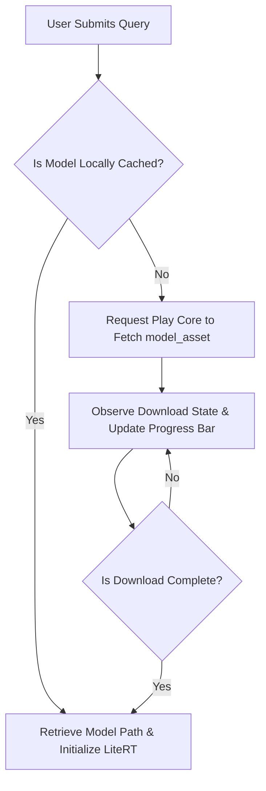

# Build and Asset Packaging Guide - Admission Counselor AI

This document details the Gradle multi-module layout, Google Play Asset Delivery (PAD) configurations, model asset downloading pipelines, and offline database provisioning logic.

---

## 1. Project Module Structure

The Android project is structured as a multi-module Gradle project to separate the primary application runtime from the heavy model asset package.

```
project-root/
│
├── build.gradle (Project level)
├── settings.gradle
│
├── app/ (Main application module)
│   ├── build.gradle
│   └── src/main/
│       ├── assets/
│       │   └── databases/
│       │       └── admission.db (Offline database template)
│       └── java/com/admission/counselor/ (Java/Kotlin Source)
│
└── model_asset/ (Play Asset Delivery module)
    ├── build.gradle
    └── src/main/assets/
        └── gemma-4-E2B-it.litertlm (2.58 GB Model File)
```

---

## 2. Play Asset Delivery (PAD) Configuration

Google Play Store restricts base APK package sizes to **150 MB**. The `gemma-4-E2B-it` model file is **2.58 GB** on-disk. To deliver this asset, the project uses **on-demand** Play Asset Delivery.

### 2.1 settings.gradle Configuration
Declare the application and asset pack modules in the project settings file:

```groovy
// settings.gradle
pluginManagement {
    repositories {
        google()
        mavenCentral()
        gradlePluginPortal()
    }
}
dependencyResolutionManagement {
    repositoriesMode.set(RepositoriesMode.FAIL_ON_PROJECT_REPOS)
    repositories {
        google()
        mavenCentral()
    }
}
rootProject.name = "AdmissionCounselorAI"
include ':app'
include ':model_asset'
project(':model_asset').projectDir = new File(rootDir, 'model_asset')
```

### 2.2 model_asset/build.gradle Configuration
Apply the asset-pack plugin and set the delivery mode to `on-demand`:

```groovy
// model_asset/build.gradle
plugins {
    id 'com.android.asset-pack'
}

assetPack {
    packName = "model_asset"
    dynamicDelivery {
        deliveryMode = "on-demand"
    }
}
```

### 2.3 app/build.gradle Configuration
Link the main application module with the asset pack and declare Play Core dependencies:

```groovy
// app/build.gradle
plugins {
    id 'com.android.application'
    id 'kotlin-android'
}

android {
    namespace 'com.admission.counselor'
    compileSdk 34

    defaultConfig {
        applicationId "com.admission.counselor"
        minSdk 29
        targetSdk 34
        versionCode 1
        versionName "1.0.0"
    }

    buildTypes {
        release {
            minifyEnabled true
            proguardFiles getDefaultProguardFile('proguard-android-optimize.txt'), 'proguard-rules.pro'
        }
    }
}

dependencies {
    implementation 'com.google.android.play:asset-delivery:2.2.2'
    implementation 'com.google.android.play:asset-delivery-ktx:2.2.2'
    assetPack ':model_asset'
}
```

---

## 3. Model Download and Installation Pipeline

Since the model uses `on-demand` delivery, the application triggers the download process programmatically when the user first attempts to interact with the counselor.



### 3.1 Play Core Asset Pack API Integration

```kotlin
class ModelAssetLoader(private val context: Context) {
    private val assetPackManager = AssetPackManagerFactory.getInstance(context)

    fun checkAndDownloadModel(
        onProgress: (Float) -> Unit,
        onComplete: (String) -> Unit,
        onError: (Exception) -> Unit
    ) {
        val packName = "model_asset"
        val packStates = assetPackManager.getPackStates(listOf(packName))

        packStates.addOnSuccessListener { states ->
            val packState = states.packStates()[packName]
            if (packState != null) {
                when (packState.status()) {
                    AssetPackStatus.COMPLETED -> {
                        val location = assetPackManager.getPackLocation(packName)
                        if (location != null) {
                            onComplete(location.assetsPath() + "/gemma-4-E2B-it.litertlm")
                        } else {
                            onError(IllegalStateException("Pack downloaded but path not resolved"))
                        }
                    }
                    else -> triggerDownload(packName, onProgress, onComplete, onError)
                }
            }
        }.addOnFailureListener { exception ->
            onError(exception)
        }
    }

    private fun triggerDownload(
        packName: String,
        onProgress: (Float) -> Unit,
        onComplete: (String) -> Unit,
        onError: (Exception) -> Unit
    ) {
        assetPackManager.registerListener { state ->
            if (state.name() == packName) {
                when (state.status()) {
                    AssetPackStatus.DOWNLOADING -> {
                        val progress = state.bytesDownloaded().toFloat() / state.totalBytesToDownload()
                        onProgress(progress)
                    }
                    AssetPackStatus.COMPLETED -> {
                        val location = assetPackManager.getPackLocation(packName)
                        if (location != null) {
                            onComplete(location.assetsPath() + "/gemma-4-E2B-it.litertlm")
                        }
                    }
                    AssetPackStatus.FAILED -> {
                        onError(RuntimeException("Asset pack download failed with error code: ${state.errorCode()}"))
                    }
                }
            }
        }
        assetPackManager.fetch(listOf(packName))
    }
}
```

---

## 4. SQLite Database Provisioning (First Run Seeding)

The static database templates (`admission.db`) are compiled directly into the main app assets directory. Because read/write SQLite connections are blocked within the `/assets/` APK folder, the database is copied to sandboxed storage upon first app launch.

### 4.1 Database Seeding Pipeline Steps

| Step | Operation Details | File Path Mappings |
| :--- | :--- | :--- |
| **1. Seed Verification** | Check if the target database file already exists in the private databases directory. | Checks: `/data/user/0/com.admission.counselor/databases/admission.db` |
| **2. Asset Streaming** | Open an InputStream reading from the static read-only asset package folder. | Reads from: `app/src/main/assets/databases/admission.db` |
| **3. Sandbox Writing** | Stream the data chunks into a file output stream pointing to the sandbox location. | Writes to: `/data/user/0/com.admission.counselor/databases/admission.db` |
| **4. Cryptography Hook** | Initialize the database instance using SQLCipher, passing the Keystore-generated password. | Calls Room Database initialization using the passphrase. |
